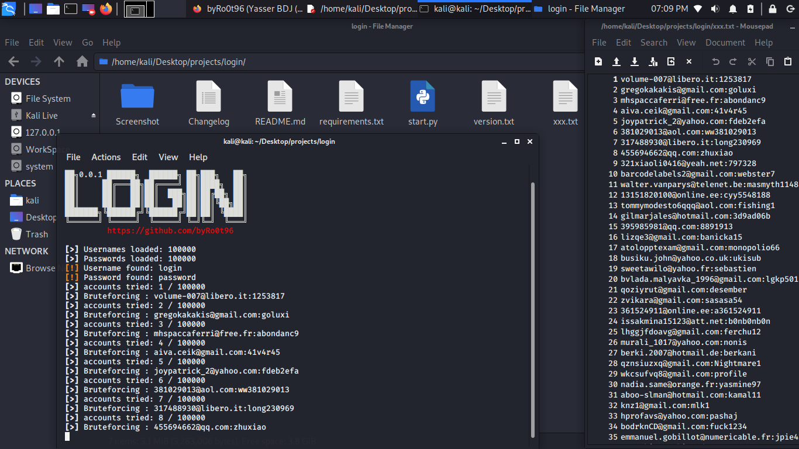

# login
'login' for brute login and try a list of usernames:passwords from a .txt file.

<div align="center">
    <!--a href="" target="_blank"-->
        
    <!--/a-->
</div>
<!---->


### Languages :
* python

### System :
* Linux
* windows

# Requirements
[✓] mechanize
[✓] bs4
[✓] lxml
[✓] itertools
[✓] cookielib
[✓] os
[✓] sys
[✓] bs4
[✓] re
[✓] urllib
[✓] urllib2
[✓] random


# How to get this tool
```
git clone https://github.com/byRo0t96/login.git
cd login
```

# How to run after download
```
pip install -r requirements.txt
python start.py website.com exemple.txt
```

# Usage
use the command 'python start.py website.com exemple.txt'.
type of list in .txt file is 'username:password'


# SUPPORTED DISTRIBUTIONS
|Distribution | Version Check | supported | status |
----------|-------|------|-------|
|Kali Linux|2020.1 | yes | working   |
|windows|10 | yes | working   |


## Release History
```
[◉] Version 0.0.2 [09-04-2020]
[◉] Version 0.0.1 [04-04-2020]
...
```


### Contact :
##### Mail : by.root96@gmail.com

## License
Copyright (C) 2010 - 2020 [byRo0t96](https://byro0t96.github.io/)

